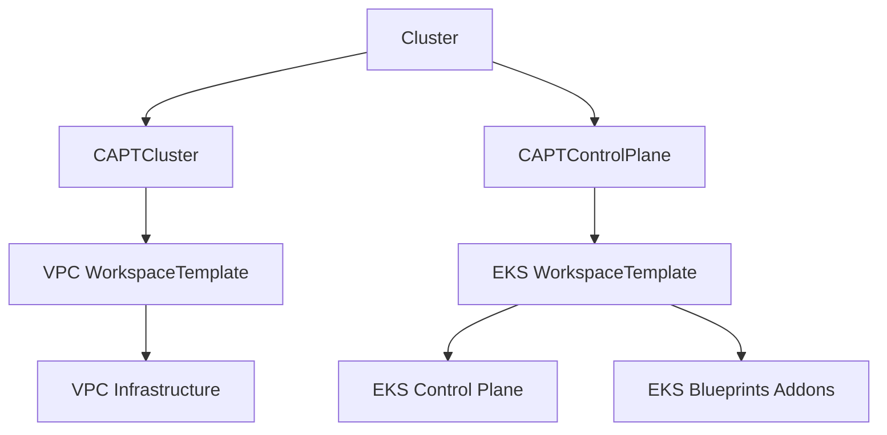

# CAPT (Cluster API Provider Terraform)

CAPT is a Cluster API provider that leverages Terraform to create and manage EKS clusters on AWS. It uses Crossplane's Terraform Provider to manage infrastructure components through Kubernetes-native resources.

## Overview

CAPT implements a modular approach to EKS cluster management where each infrastructure component (VPC, Control Plane) is managed through its own WorkspaceTemplate. This design enables:

- Clear separation of concerns between infrastructure components
- Reusable infrastructure templates
- Secure configuration management through Kubernetes secrets
- Terraform-based state management and drift detection

## Architecture

The cluster creation is divided into three main components:

1. VPC Infrastructure
2. EKS Control Plane
3. Cluster Configuration

Each component is managed independently through WorkspaceTemplates:



## Key Benefits

### 1. Declarative Infrastructure Management
- Version control and tagging for clear configuration management
- State tracking for configuration drift detection
- Utilization of standard Terraform modules

### 2. Robust Dependency Management
- Explicit dependency definition between components (e.g., VPC and EKS)
- Secure configuration propagation through secrets
- Independent lifecycle management for each component

### 3. Secure Configuration Management
- Secure handling of sensitive information through Kubernetes secrets
- Automatic OIDC authentication and IAM role configuration
- Centralized security group and network policy management
- Secure configuration migration between environments

### 4. High Operability and Reusability
- Reusable infrastructure templates
- Customization through environment-specific variables and tags
- Automatic management of Helm charts and EKS addons
- Compatibility with existing Terraform modules

### 5. Modern Kubernetes Feature Integration
- Automatic Fargate profile configuration
- Efficient node scaling with Karpenter
- Integrated EKS addon management
- Extensibility through Custom Resource Definitions (CRDs)

## Prerequisites

- Kubernetes cluster (v1.19+)
- Cluster API (v1.0+)
- AWS credentials with appropriate permissions
- Crossplane with Terraform Provider installed

## Installation

1. Install the CRDs:
```bash
kubectl apply -f config/crd/bases
```

2. Deploy the controller:
```bash
kubectl apply -f config/default
```

3. Configure AWS credentials:
```bash
kubectl apply -f crossplane-terraform-config/aws-creds-secre-sample.yaml
kubectl apply -f crossplane-terraform-config/provider-config.yaml
```

## Usage

### 1. Create VPC Infrastructure

```yaml
apiVersion: infrastructure.cluster.x-k8s.io/v1beta1
kind: WorkspaceTemplateApply
metadata:
  name: demo-vpc-apply
spec:
  templateRef:
    name: vpc-template
  variables:
    name: demo-cluster-vpc
```

### 2. Create EKS Control Plane

```yaml
apiVersion: controlplane.cluster.x-k8s.io/v1beta1
kind: CAPTControlPlane
metadata:
  name: demo-cluster
spec:
  version: "1.31"
  workspaceTemplateRef:
    name: eks-controlplane-template
```

### 3. Apply Cluster Configuration

```yaml
apiVersion: cluster.x-k8s.io/v1beta1
kind: Cluster
metadata:
  name: demo-cluster
spec:
  clusterNetwork:
    services:
      cidrBlocks: ["10.96.0.0/12"]
    pods:
      cidrBlocks: ["192.168.0.0/16"]
  infrastructureRef:
    apiVersion: infrastructure.cluster.x-k8s.io/v1beta1
    kind: CAPTCluster
    name: demo-cluster
  controlPlaneRef:
    apiVersion: controlplane.cluster.x-k8s.io/v1beta1
    kind: CAPTControlPlane
    name: demo-cluster
```

## Best Practices

### 1. Resource Management
- Manage related resources in the same namespace
- Use consistent naming conventions
- Define clear dependencies between components
- Regular configuration drift checks

### 2. Security
- Manage sensitive information as secrets
- Follow the principle of least privilege for IAM configuration
- Proper security group configuration
- Implement secure network policies

### 3. Operations
- Separate configurations per environment
- Utilize version control effectively
- Monitor and manage component lifecycles
- Regular security and compliance audits

### 4. Template Management
- Document template purposes and requirements
- Version templates appropriately
- Implement proper tagging strategies
- Maintain backward compatibility

## Features

### WorkspaceTemplate Management
- Infrastructure as code using Terraform
- Version control and metadata tracking
- Secure secret management
- Reusable infrastructure templates

### VPC Configuration
- Multi-AZ deployment
- Public and private subnets
- NAT Gateway configuration
- EKS and Karpenter integration

### EKS Control Plane
- Fargate profiles for system workloads
- EKS Blueprints addons integration
- CoreDNS, VPC-CNI, and Kube-proxy configuration
- Karpenter setup for node management

## Contributing

1. Fork the repository
2. Create a feature branch
3. Commit your changes
4. Push to the branch
5. Create a Pull Request

## License

This project is licensed under the Apache License 2.0 - see the LICENSE file for details.
