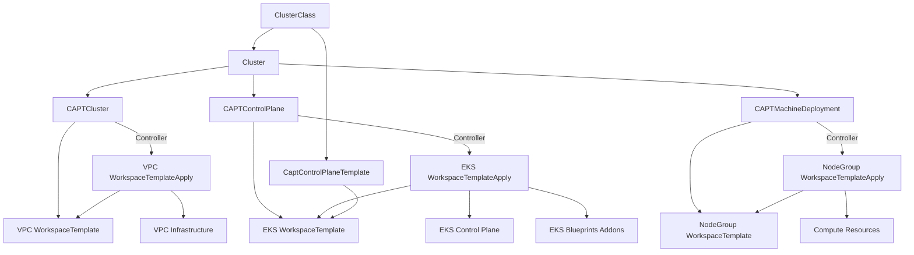

# CAPT (Cluster API Provider Terraform)

CAPT is a Cluster API provider that leverages Terraform to create and manage EKS clusters on AWS. It uses Crossplane's Terraform Provider to manage infrastructure components through Kubernetes-native resources.

## Overview

CAPT implements a modular approach to EKS cluster management where each infrastructure component (VPC, Control Plane, Machine Resources) is managed through its own WorkspaceTemplate. This design enables:

- Clear separation of concerns between infrastructure components
- Reusable infrastructure templates
- Secure configuration management through Kubernetes secrets
- Terraform-based state management and drift detection
- ClusterClass support for standardized cluster deployments
- Independent compute resource management through Machine concept

## Architecture

The cluster creation is divided into four main components:

1. VPC Infrastructure
2. EKS Control Plane
3. Compute Resources (Machine)
4. Cluster Configuration

Each component is managed independently through WorkspaceTemplates and can be templated using ClusterClass. The controllers automatically manage WorkspaceTemplateApply resources for infrastructure provisioning:



## Key Benefits

### 1. Declarative Infrastructure Management
- Version control and tagging for clear configuration management
- State tracking for configuration drift detection
- Utilization of standard Terraform modules
- ClusterClass templates for standardized deployments
- Automatic WorkspaceTemplateApply management by controllers
- VPC retention capability for shared infrastructure scenarios

### 2. Robust Dependency Management
- Explicit dependency definition between components (e.g., VPC and EKS)
- Secure configuration propagation through secrets
- Independent lifecycle management for each component
- Template-based configuration with variable substitution

### 3. Secure Configuration Management
- Secure handling of sensitive information through Kubernetes secrets
- Automatic OIDC authentication and IAM role configuration
- Centralized security group and network policy management
- Secure configuration migration between environments

### 4. High Operability and Reusability
- Reusable infrastructure templates
- Customization through environment-specific variables and tags
- Automatic management of Helm charts and EKS addons
- Compatibility with existing Terraform modules
- ClusterClass for consistent cluster deployments

### 5. Modern Kubernetes Feature Integration
- Automatic Fargate profile configuration
- Efficient node scaling with Karpenter
- Integrated EKS addon management
- Extensibility through Custom Resource Definitions (CRDs)
- ClusterTopology support for advanced cluster management

## Quick Start Guide

For detailed installation instructions, please refer to [INSTALL.md](INSTALL.md).

This guide will help you get started with using CAPT to manage your EKS clusters.

### Prerequisites

Before you begin, ensure you have:

1. CAPT installed (see [INSTALL.md](INSTALL.md))
2. AWS credentials properly configured
3. A running Kubernetes cluster with Cluster API and CAPT

### Creating Your First EKS Cluster

1. Create a VPC WorkspaceTemplate:
   ```yaml
   apiVersion: infrastructure.cluster.x-k8s.io/v1beta1
   kind: WorkspaceTemplate
   metadata:
     name: simple-vpc
   spec:
     template:
       metadata:
         description: "Simple VPC configuration"
       spec:
         module:
           source: "terraform-aws-modules/vpc/aws"
           version: "5.0.0"
         variables:
           name:
             value: "simple-vpc"
           cidr:
             value: "10.0.0.0/16"
   ```
   Save this as `simple-vpc.yaml` and apply it:
   ```bash
   kubectl apply -f simple-vpc.yaml
   ```

2. Create a CAPTCluster resource:
   ```yaml
   apiVersion: infrastructure.cluster.x-k8s.io/v1beta1
   kind: CAPTCluster
   metadata:
     name: simple-cluster
   spec:
     region: us-west-2
     vpcTemplateRef:
       name: simple-vpc
   ```
   Save this as `simple-cluster.yaml` and apply it:
   ```bash
   kubectl apply -f simple-cluster.yaml
   ```

3. Create a Cluster resource:
   ```yaml
   apiVersion: cluster.x-k8s.io/v1beta1
   kind: Cluster
   metadata:
     name: simple-cluster
   spec:
     infrastructureRef:
       apiVersion: infrastructure.cluster.x-k8s.io/v1beta1
       kind: CAPTCluster
       name: simple-cluster
   ```
   Save this as `cluster.yaml` and apply it:
   ```bash
   kubectl apply -f cluster.yaml
   ```

### Monitoring Cluster Creation

1. Check the status of your cluster:
   ```bash
   kubectl get clusters
   ```

2. View the CAPTCluster resource:
   ```bash
   kubectl get captclusters
   ```

3. Check the WorkspaceTemplateApply resources:
   ```bash
   kubectl get workspacetemplateapplies
   ```

### Accessing Your EKS Cluster

Once the cluster is ready:

1. Get the kubeconfig for your new EKS cluster:
   ```bash
   aws eks get-token --cluster-name simple-cluster > kubeconfig
   ```

2. Use the new kubeconfig to interact with your EKS cluster:
   ```bash
   kubectl --kubeconfig=./kubeconfig get nodes
   ```

## Usage

### 1. Using ClusterClass (Recommended)

ClusterClass provides a templated approach to cluster creation, enabling standardized deployments across your organization:

1. Define ClusterClass:
```yaml
apiVersion: cluster.x-k8s.io/v1beta1
kind: ClusterClass
metadata:
  name: eks-class
spec:
  controlPlane:
    ref:
      apiVersion: controlplane.cluster.x-k8s.io/v1beta1
      kind: CaptControlPlaneTemplate
      name: eks-control-plane-template
  variables:
    - name: controlPlane.version
      required: true
      schema:
        openAPIV3Schema:
          type: string
          enum: ["1.27", "1.28", "1.29", "1.30", "1.31"]
```

2. Create Cluster using ClusterClass:
```yaml
apiVersion: cluster.x-k8s.io/v1beta1
kind: Cluster
metadata:
  name: demo-cluster
spec:
  topology:
    class: eks-class
    version: "1.31"
    variables:
      - name: controlPlane.version
        value: "1.31"
      - name: environment
        value: dev
```

### 2. Traditional Approach

#### Create VPC Infrastructure Template with Retention

```yaml
apiVersion: infrastructure.cluster.x-k8s.io/v1beta1
kind: WorkspaceTemplate
metadata:
  name: vpc-template
spec:
  template:
    metadata:
      description: "Standard VPC configuration"
    spec:
      module:
        source: "terraform-aws-modules/vpc/aws"
        version: "5.0.0"
      variables:
        name:
          value: "${var.name}"
        cidr:
          value: "10.0.0.0/16"
```

#### Create CAPTCluster with VPC Retention

```yaml
apiVersion: infrastructure.cluster.x-k8s.io/v1beta1
kind: CAPTCluster
metadata:
  name: demo-cluster
spec:
  region: us-west-2
  vpcTemplateRef:
    name: vpc-template
    namespace: default
  retainVpcOnDelete: true  # VPC will be retained when cluster is deleted
```

#### Create Compute Resources (Machine)

```yaml
apiVersion: infrastructure.cluster.x-k8s.io/v1beta1
kind: CAPTMachineDeployment
metadata:
  name: demo-nodegroup
spec:
  replicas: 3
  template:
    spec:
      workspaceTemplateRef:
        name: nodegroup-template
      instanceType: t3.medium
      diskSize: 50
```

#### Create NodeGroup Template

```yaml
apiVersion: infrastructure.cluster.x-k8s.io/v1beta1
kind: WorkspaceTemplate
metadata:
  name: nodegroup-template
spec:
  template:
    metadata:
      description: "EKS Node Group configuration"
    spec:
      module:
        source: "./internal/tf_module/eks_node_group"
      variables:
        instance_types:
          value: ["${var.instance_type}"]
        disk_size:
          value: "${var.disk_size}"
```

#### Apply Cluster Configuration

```yaml
apiVersion: cluster.x-k8s.io/v1beta1
kind: Cluster
metadata:
  name: demo-cluster
spec:
  clusterNetwork:
    services:
      cidrBlocks: ["10.96.0.0/12"]
    pods:
      cidrBlocks: ["192.168.0.0/16"]
  infrastructureRef:
    apiVersion: infrastructure.cluster.x-k8s.io/v1beta1
    kind: CAPTCluster
    name: demo-cluster
  controlPlaneRef:
    apiVersion: controlplane.cluster.x-k8s.io/v1beta1
    kind: CAPTControlPlane
    name: demo-cluster
```

Note: WorkspaceTemplateApply resources are automatically created and managed by the controllers. You do not need to create them manually.

## Best Practices

### 1. Resource Management
- Manage related resources in the same namespace
- Use consistent naming conventions
- Define clear dependencies between components
- Regular configuration drift checks
- Utilize ClusterClass for standardized deployments
- Let controllers manage WorkspaceTemplateApply resources

### 2. Security
- Manage sensitive information as secrets
- Follow the principle of least privilege for IAM configuration
- Proper security group configuration
- Implement secure network policies

### 3. Operations
- Separate configurations per environment
- Utilize version control effectively
- Monitor and manage component lifecycles
- Regular security and compliance audits
- Use ClusterClass for consistent deployments

### 4. Template Management
- Document template purposes and requirements
- Version templates appropriately
- Implement proper tagging strategies
- Maintain backward compatibility
- Leverage ClusterClass variables for flexibility
- Use WorkspaceTemplate for infrastructure definitions
- Let controllers handle WorkspaceTemplateApply lifecycle

## Features

### ClusterClass Support
- Standardized cluster templates
- Variable-based configuration
- Reusable control plane templates
- Consistent cluster deployments
- Environment-specific customization

### WorkspaceTemplate Management
- Infrastructure as code using Terraform
- Version control and metadata tracking
- Secure secret management
- Reusable infrastructure templates
- Automatic WorkspaceTemplateApply management by controllers

### Machine Management
- Independent compute resource lifecycle
- Flexible node group configuration
- Support for multiple instance types
- Automated scaling configuration
- Integration with cluster autoscaling
- Template-based node group management

### VPC Management
- Multi-AZ deployment
- Public and private subnets
- NAT Gateway configuration
- EKS and Karpenter integration
- VPC retention for shared infrastructure
- Independent VPC lifecycle management

### EKS Control Plane
- Fargate profiles for system workloads
- EKS Blueprints addons integration
- CoreDNS, VPC-CNI, and Kube-proxy configuration
- Karpenter setup for node management
- Template-based configuration with ClusterClass

## Contributing

1. Fork the repository
2. Create a feature branch
3. Commit your changes
4. Push to the branch
5. Create a Pull Request

## Releasing

CAPT uses an automated release process through GitHub Actions. When creating a new release:

1. Update the version number in relevant files (e.g., `VERSION`, `Chart.yaml`, etc.)
2. Update the CHANGELOG.md file with the new version and its changes
3. Create and push a new tag:
   ```bash
   # For Release Candidates
   git tag -a v1.0.0-rc1 -m "Release Candidate 1 for v1.0.0"
   
   # For Stable Releases
   git tag -a v1.0.0 -m "Release v1.0.0"
   
   git push origin <tag-name>
   ```

The release workflow will automatically:
- Build and push multi-architecture Docker images (amd64/arm64) to ghcr.io/appthrust/capt
- Generate the capt.yaml installer
- Create a GitHub release with:
  - Release notes from CHANGELOG.md
  - capt.yaml installer as an asset
  - Links to the container images

Users can then:
1. Download and apply the capt.yaml installer
2. Or use the container images directly from ghcr.io/appthrust/capt

Note: Release Candidates (RC) are tagged with `-rc` suffix and are primarily for testing. Production deployments should use stable releases.

## License

This project is licensed under the MIT License - see the [LICENSE](LICENSE) file for details.
