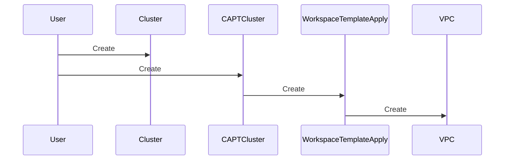

# CAPTEP-0010: VPC Creation Validation

## Summary

本提案は、CAPTClusterによるVPC作成機能の検証結果と、その過程で得られた知見をまとめ、今後の改善点を提示します。

## Motivation

CAPTClusterのVPC作成機能は、クラスターインフラストラクチャの重要な部分です。この機能の信頼性と正確性を確保するために、詳細な検証が必要でした。

## Goals

- VPC作成機能の正常動作の確認
- WorkspaceTemplateとの連携の検証
- 実際の運用における注意点の特定

## Non-Goals

- VPCの詳細な設定の最適化
- パフォーマンスチューニング
- 新機能の追加

## Proposal

### 1. 検証された動作フロー



### 2. 重要なコンポーネント

1. WorkspaceTemplate
```yaml
apiVersion: infrastructure.cluster.x-k8s.io/v1beta1
kind: WorkspaceTemplate
metadata:
  name: vpc-template
spec:
  template:
    metadata:
      description: "Standard VPC configuration for EKS clusters"
```

2. CAPTCluster
```yaml
apiVersion: infrastructure.cluster.x-k8s.io/v1beta1
kind: CAPTCluster
metadata:
  name: demo-cluster
spec:
  region: "ap-northeast-1"
  vpcTemplateRef:
    name: vpc-template
```

## Implementation Details

### Phase 1: 基本機能の検証

1. リソース作成の順序
   - WorkspaceTemplate
   - Cluster
   - CAPTCluster

2. 状態の確認
   - WorkspaceTemplateApplyのステータス
   - VPCの作成状態

### Phase 2: エラーケースの検証

今後の課題として：

1. テンプレート不在時の挙動
2. リージョン不整合時の挙動
3. 権限不足時の挙動

## Risks and Mitigations

### リスク

1. リソース作成の順序依存性
   - リスク: 依存関係による作成失敗
   - 対策: 明確な順序の文書化

2. ステータス更新の遅延
   - リスク: 状態把握の遅れ
   - 対策: 適切なポーリング間隔の設定

## Alternatives Considered

1. 直接的なVPC作成
   - 却下理由: 柔軟性の欠如
   - WorkspaceTemplateの利点を活かせない

2. マルチVPCサポート
   - 却下理由: 現時点での必要性が低い
   - 将来の拡張として検討

## References

1. [VPC Creation Test Results](../design/vpc-creation-test-results.md)
2. [Workspace Template Design](../workspace-template-design.md)

## Implementation History

- 2024-11-12: 初期検証実施
- 2024-11-12: ドキュメント作成
