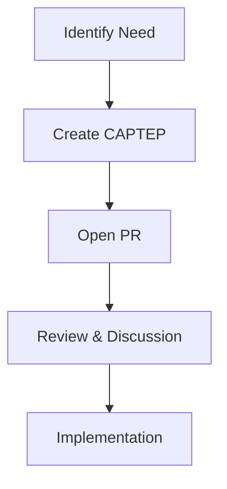

# CAPTEP-0029: Standardizing Enhancement Proposal Format

## Table of Contents

- [Summary](#summary)
- [Motivation](#motivation)
  - [Goals](#goals)
  - [Non-Goals](#non-goals)
- [Proposal](#proposal)
  - [User Stories](#user-stories)
  - [Implementation Details](#implementation-details)
  - [Risks and Mitigations](#risks-and-mitigations)
- [Alternatives Considered](#alternatives-considered)
- [Upgrade Strategy](#upgrade-strategy)

## Summary

This proposal aims to standardize the format of CAPT Enhancement Proposals (CAPTEPs) to ensure consistency, clarity, and completeness in documenting significant changes and improvements to the CAPT project.

## Motivation

As CAPT continues to evolve, we need a standardized way to propose, discuss, and document significant changes to the project. A well-defined enhancement proposal format helps maintainers and contributors understand the impact and implementation details of proposed changes.

### Goals

- Define a standard format for CAPT Enhancement Proposals
- Ensure comprehensive documentation of proposed changes
- Facilitate effective review and discussion of proposals
- Maintain historical record of design decisions

### Non-Goals

- Replacing existing documentation formats (ADRs, design docs)
- Enforcing the format for minor changes or bug fixes
- Creating a bureaucratic process that slows down development

## Proposal

### User Stories

#### Story 1: Proposal Author

As a contributor to CAPT, I want to have a clear template for writing enhancement proposals so that I can effectively communicate my ideas and implementation plans.

#### Story 2: Proposal Reviewer

As a CAPT maintainer, I want to review proposals in a consistent format so that I can efficiently evaluate their impact and feasibility.

### Implementation Details

#### CAPTEP Format

1. File Naming:
```
docs/CAPTEP/NNNN-descriptive-title.md
```
Where NNNN is a sequential number starting from 0001.

2. Required Sections:

```markdown
# CAPTEP-NNNN: Title

## Table of Contents
[Generated ToC]

## Summary
A brief overview of the proposal (1-2 paragraphs).

## Motivation
Why this enhancement is needed.

### Goals
Specific objectives to be achieved.

### Non-Goals
What is explicitly out of scope.

## Proposal

### User Stories
Real-world scenarios and use cases.

### Implementation Details
Technical details including:
- Architecture changes
- API changes
- Implementation approach
- Code examples
- Migration considerations

### Risks and Mitigations
Potential issues and how to address them.

## Alternatives Considered
Other approaches that were evaluated.

## Upgrade Strategy
How to roll out the change, including:
- Implementation phases
- Backward compatibility
- Testing strategy
```

3. Optional Sections:
```markdown
## Performance Implications
Impact on system performance.

## Dependencies
External dependencies and requirements.

## References
Related documents, issues, or PRs.
```

#### Workflow

1. Proposal Creation:


2. Status Tracking:
```yaml
status: provisional | implementable | implemented | deferred | rejected | withdrawn | replaced
last-updated: YYYY-MM-DD
```

### Risks and Mitigations

1. Risk: Over-formalization
   - Mitigation: Allow flexibility within the format while maintaining core sections

2. Risk: Proposal Overhead
   - Mitigation: Only require CAPTEPs for significant changes

3. Risk: Format Drift
   - Mitigation: Implement automated format validation

## Alternatives Considered

### Alternative 1: Kubernetes KEP Format

Directly adopt the Kubernetes Enhancement Proposal format:
- Pros: Well-established, comprehensive
- Cons: May be too complex for CAPT's needs

### Alternative 2: RFC Format

Use a simpler RFC-style format:
- Pros: Lighter weight, faster to write
- Cons: May miss important details

### Alternative 3: GitHub Issues Only

Rely solely on GitHub issues for proposals:
- Pros: Familiar, easy to use
- Cons: Lacks structure, harder to track history

## Upgrade Strategy

1. Implementation Phases:
   - Phase 1: Document the new format
   - Phase 2: Update existing CAPTEPs
   - Phase 3: Add format validation

2. Documentation:
   - Add template to project
   - Update contributing guidelines
   - Provide example CAPTEPs

3. Testing:
   - Create format validation tools
   - Review existing proposals
   - Gather feedback from maintainers
