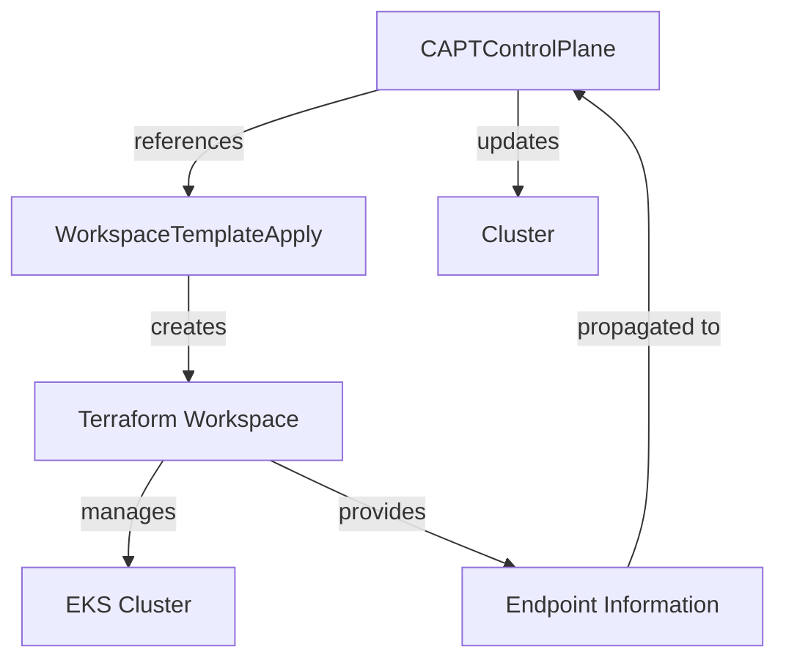
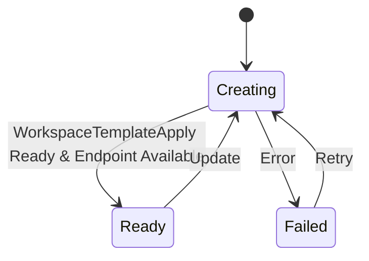

# ControlPlane Status Management Design

## Overview

This document describes the high-level design of status management in the CAPTControlPlane controller, focusing on how it reflects the state of the underlying EKS cluster through WorkspaceTemplateApply resources.

## Background

The CAPTControlPlane controller needs to accurately reflect the state of the EKS cluster creation process. Initially, the controller only checked the Terraform workspace state, which led to premature "Ready" states before the actual EKS cluster was fully operational.

## Design Goals

1. Accurate Status Reflection
   - Reflect the true state of the EKS cluster
   - Provide clear phase transitions
   - Handle error states appropriately
   - Manage control plane endpoint information

2. Resource Management
   - Maintain consistent relationship with WorkspaceTemplateApply
   - Support existing deployments
   - Enable smooth migration path
   - Own and manage control plane endpoint

3. Operational Requirements
   - Clear status visibility for operators
   - Reliable state tracking
   - Proper error reporting
   - Accurate endpoint propagation

## High-Level Design

### Status Management

The CAPTControlPlane status is determined by:
1. WorkspaceTemplateApply state (Applied, Synced, Ready)
2. Workspace conditions
3. Error conditions
4. Control plane endpoint availability

### Resource Relationship

### Status Flow

## Implementation Strategy

1. WorkspaceTemplateApply Reference
   - Store reference in CAPTControlPlane spec
   - Support migration from existing deployments
   - Maintain backward compatibility

2. Status Updates
   - Regular reconciliation
   - Condition-based updates
   - Clear phase transitions
   - Endpoint information management

3. Endpoint Management
   - Primary responsibility for endpoint information
   - Retrieval from Terraform outputs
   - Propagation to Cluster resource
   - Validation of endpoint availability

## Migration Path

1. Existing Deployments
   - Detect existing WorkspaceTemplateApply
   - Update spec with reference
   - Maintain existing resource names
   - Handle endpoint information transition

2. New Deployments
   - Create with new naming scheme
   - Store reference immediately
   - Manage endpoint information from creation

## Success Criteria

1. Status Accuracy
   - Status reflects actual EKS cluster state
   - Clear phase transitions
   - Proper error reporting
   - Accurate endpoint information

2. Resource Management
   - Consistent WorkspaceTemplateApply references
   - No resource duplication
   - Clean migration path
   - Reliable endpoint management

## Future Considerations

1. Enhanced Status Information
   - Additional cluster details
   - More detailed phase information
   - Extended error reporting
   - Enhanced endpoint validation

2. Resource Cleanup
   - Improved garbage collection
   - Better resource tracking
   - Endpoint cleanup handling

3. Endpoint Management Improvements
   - Enhanced validation mechanisms
   - Health checking capabilities
   - Automatic recovery procedures
