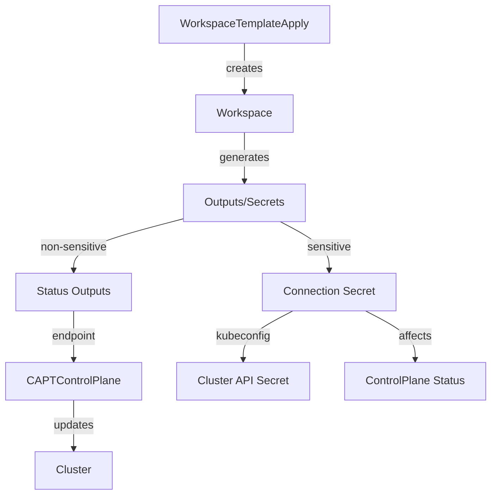
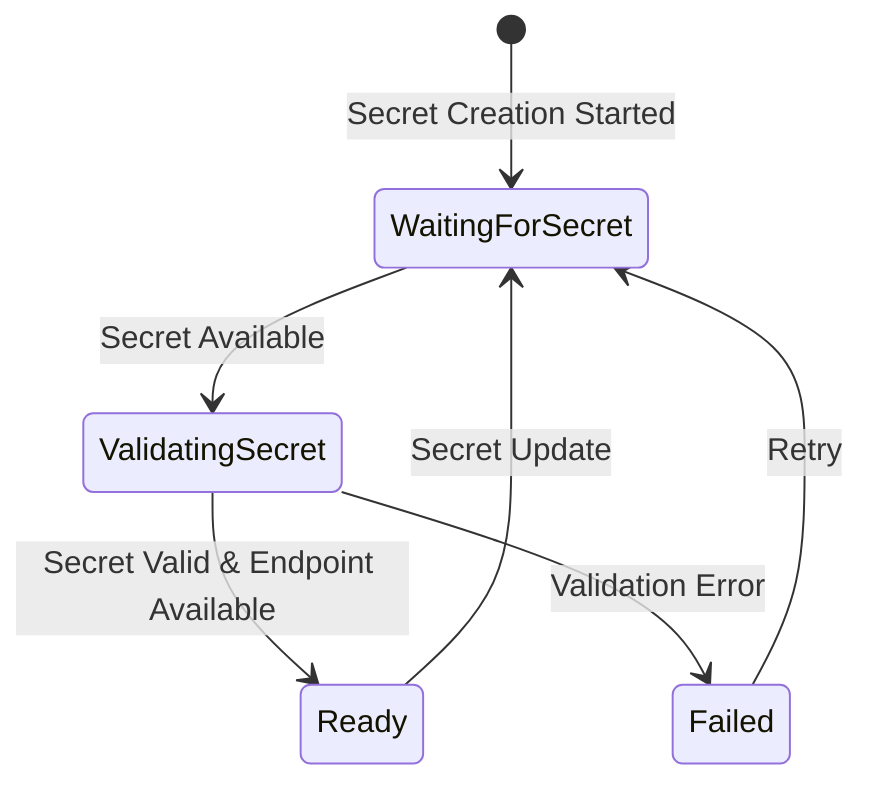

# Control Plane Secret Management Design

## Overview

このドキュメントは、CAPTプロジェクトにおけるControl Plane Secrets管理の設計と実装の詳細を説明します。
特に、WorkspaceTemplateApplyによって生成されるSecretsとCluster APIのプロトコルに準拠したSecretsの関係性に焦点を当てます。

このドキュメントは[Endpoint Management](endpoint-management.md)および[ControlPlane Status Management](controlplane-status-management.md)と密接に関連しており、これらのコンポーネントは協調して動作します。

## アーキテクチャ

### コンポーネントの相互作用



### ステータスフロー



### Secret管理の二重構造

#### 1. WorkspaceTemplateApply Secrets

WorkspaceTemplateApplyは、Terraformの出力を以下の形式でSecretとして保存します：

```yaml
apiVersion: v1
kind: Secret
metadata:
  name: ${CLUSTER_NAME}-eks-connection
  namespace: default
data:
  kubeconfig: <base64-encoded-kubeconfig>
  cluster_certificate_authority_data: <base64-encoded-ca-data>
```

このSecretは、EKSクラスターへの接続に必要な全ての情報を含みます。

#### 2. Cluster API Secrets

Cluster APIのプロトコルに準拠するため、以下の形式の追加のSecretを作成します：

```yaml
apiVersion: v1
kind: Secret
metadata:
  name: ${CLUSTER_NAME}-control-plane-kubeconfig
  namespace: default
  ownerReferences:
    - apiVersion: controlplane.cluster.x-k8s.io/v1beta1
      kind: CAPTControlPlane
      name: ${CLUSTER_NAME}
      uid: <controller-uid>
data:
  value: <base64-encoded-kubeconfig>
```

## ステータス管理との統合

### 1. Secret状態の反映

CAPTControlPlaneのステータスは以下の条件に基づいて更新されます：

1. Connection Secretの存在
2. 必須フィールドの検証
3. kubeconfigの有効性
4. エンドポイントの可用性

### 2. 状態遷移

- **WaitingForSecret**: Secret作成待ち
- **ValidatingSecret**: Secret検証中
- **Ready**: Secret有効かつエンドポイント利用可能
- **Failed**: 検証エラーまたはエンドポイント未取得

### 3. エラー状態

エラー状態は以下の場合に発生します：

1. Secret不在
2. 必須フィールド欠落
3. kubeconfig無効
4. エンドポイント未取得

## 情報の流れ

### 1. エンドポイント情報

エンドポイント情報は[Endpoint Management](endpoint-management.md)で定義された優先順位に従います：

1. Workspace Outputs（プライマリソース）
   ```hcl
   output "cluster_endpoint" {
     value = module.eks.cluster_endpoint
   }
   ```

2. Connection Secret（フォールバック）
   ```yaml
   data:
     cluster_endpoint: <base64-encoded-endpoint>
   ```

### 2. 認証情報

認証情報は常にConnection Secretを通じて管理されます：

1. WorkspaceTemplateApplyによる生成
2. Connection Secretへの保存
3. Cluster API Secretへの転送

## 必須フィールドの最適化

### 1. 必要最小限のフィールド

WorkspaceTemplateApply Secretsに必要な最小限のフィールド：

- `kubeconfig`: クラスターへの接続情報
- `cluster_certificate_authority_data`: クラスターのCA証明書

これらのフィールドのみを必須とすることで、以下の利点があります：
- 不要なデータの削減
- エラー発生の可能性の低減
- より明確な責任分担

### 2. pod_execution_role_arnの扱い

- Fargate profilesに関連するフィールドは必須としない
- 必要な場合のみ追加フィールドとして扱う
- 基本機能に影響を与えない設計

## 実装の重要ポイント

### 1. Secret作成のタイミング

- WorkspaceTemplateApplyのSecretが作成された後
- エンドポイント情報が利用可能になった時点
- CAPTControlPlaneの reconcileSecrets フェーズで

### 2. エラーハンドリング

- Secret不在時の適切なエラーメッセージ
- 必須フィールド欠落時の明確なエラー
- リトライ可能なエラーの識別

### 3. ログ出力

- Secret作成/更新の詳細なログ
- エラー時の具体的な情報
- 処理フローの追跡可能性

## RBAC設定

Secret管理に必要なRBAC設定：

```yaml
//+kubebuilder:rbac:groups="",resources=secrets,verbs=get;list;watch;create;update;patch;delete
//+kubebuilder:rbac:groups=tf.upbound.io,resources=workspaces,verbs=get;list;watch
```

## 運用上の考慮事項

### 1. Secret管理

- 両方のSecretが存在することの確認
- kubeconfigデータの一貫性の確認
- 適切なOwnerReferenceの設定

### 2. トラブルシューティング

1. WorkspaceTemplateApply Secretの確認
   ```bash
   kubectl get secret ${CLUSTER_NAME}-eks-connection -n default
   ```

2. Cluster API Secretの確認
   ```bash
   kubectl get secret ${CLUSTER_NAME}-control-plane-kubeconfig -n default
   ```

3. エンドポイントの確認
   ```bash
   kubectl get workspace ${WORKSPACE_NAME} -o jsonpath='{.status.atProvider.outputs.cluster_endpoint}'
   ```

## 将来の改善点

1. Secret管理の強化
   - Secret暗号化の改善
   - ローテーション戦略の実装
   - アクセス制御の細分化

2. 監視とメトリクス
   - Secret作成/更新の成功率
   - 処理時間の追跡
   - エラー発生の傾向分析

3. 運用性の向上
   - 自動バックアップ
   - リカバリー手順の自動化
   - 監査ログの強化

4. ステータス管理の改善
   - より詳細な状態遷移
   - 高度な検証メカニズム
   - 自動リカバリー機能

## 参考資料

- [Cluster API Documentation](https://cluster-api.sigs.k8s.io/)
- [AWS EKS Documentation](https://docs.aws.amazon.com/eks/)
- [Terraform AWS Provider](https://registry.terraform.io/providers/hashicorp/aws/latest/docs)
- [Endpoint Management](endpoint-management.md)
- [ControlPlane Status Management](controlplane-status-management.md)
