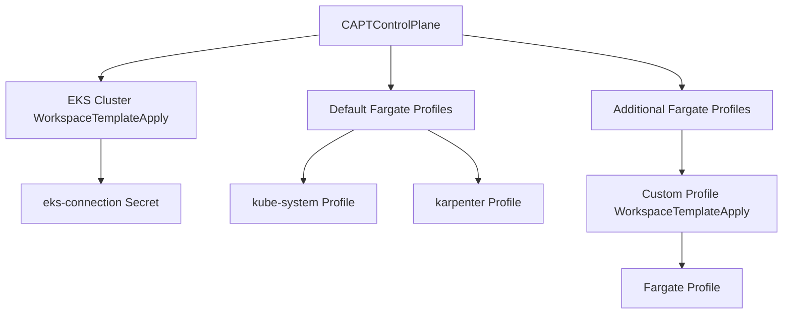

# Fargate Profile Management Design

## Overview

This document describes the design and implementation of Fargate Profile management in the CAPT (Cluster API Provider for Terraform) project. The design enables users to manage EKS Fargate profiles through the Cluster API's declarative interface.

## Design Goals

1. Default Profiles Management:
   - Provide default Fargate profiles for essential system workloads
   - Include profiles for kube-system and karpenter namespaces
   - Ensure core cluster functionality works on Fargate

2. Additional Profiles Management:
   - Allow users to define additional Fargate profiles
   - Support flexible namespace and label selectors
   - Enable independent lifecycle management

3. Dependency Management:
   - Ensure proper sequencing with EKS cluster creation
   - Handle dependencies on VPC and subnet configurations
   - Manage secret dependencies effectively

## Architecture

### Component Overview

1. CAPTControlPlane:
   - Manages the EKS control plane
   - Includes default Fargate profiles
   - Supports additional Fargate profile definitions

2. WorkspaceTemplateApply:
   - Creates individual Terraform workspaces for each profile
   - Handles secret dependencies
   - Manages profile lifecycle

3. Terraform Modules:
   - Implements the actual AWS resources
   - Handles Fargate profile creation and updates
   - Manages IAM roles and permissions

### Resource Relationships



## Implementation Details

### Default Fargate Profiles

Default profiles are created as part of the EKS cluster creation:

```yaml
fargate_profiles = {
  karpenter = {
    selectors = [
      { namespace = "karpenter" }
    ]
  }
  kube_system = {
    name = "kube-system"
    selectors = [
      { namespace = "kube-system" }
    ]
  }
}
```

### Additional Fargate Profiles

Additional profiles are managed through CAPTControlPlane spec:

```yaml
additionalFargateProfiles:
- name: monitoring
  selectors:
  - namespace: monitoring
    labels:
      workload-type: fargate
  workspaceTemplateRef:
    name: eks-fargate-profile-template
    namespace: default
```

### Dependencies and Sequencing

1. Creation Order:
   - EKS cluster creation
   - Default Fargate profiles
   - Additional Fargate profiles

2. Required Secrets:
   - eks-connection: Contains cluster information
   - vpc-connection: Contains networking configuration

## Status Management

### Profile Status Tracking

```go
type FargateProfileStatus struct {
    Name string
    Ready bool
    WorkspaceTemplateApplyName string
    FailureReason *string
    FailureMessage *string
}
```

### Condition Types

1. Profile-specific conditions:
   - FargateProfileReady
   - FargateProfileCreating
   - FargateProfileFailed

2. Status Propagation:
   - Individual profile status
   - Aggregate status in CAPTControlPlane
   - Detailed error reporting

## Error Handling

1. Creation Failures:
   - Stop on first failure
   - Detailed error messages
   - Status updates for troubleshooting

2. Dependency Issues:
   - Wait for required secrets
   - Requeue on missing dependencies
   - Clear error messages

## Future Considerations

1. Enhanced Features:
   - Profile updates and modifications
   - Selective profile deletion
   - Advanced scheduling configurations

2. Operational Improvements:
   - Better status reporting
   - Metrics and monitoring
   - Automated recovery options

3. Security Enhancements:
   - Fine-grained IAM roles
   - Security group management
   - Network policy integration
