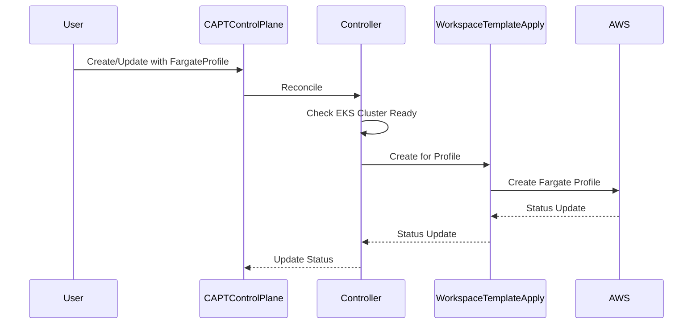

# Fargate Profile Workflow and Status Management

## Overview

This document describes the workflow and status management for Fargate Profiles in CAPT. It covers the lifecycle of Fargate profiles, from creation to deletion, and how their status is tracked and managed.

## Workflow

### Creation Flow



### Status Flow

1. Initial State:
```yaml
status:
  fargateProfileStatuses: []
  phase: Creating
```

2. Profile Creation:
```yaml
status:
  fargateProfileStatuses:
  - name: monitoring
    ready: false
    workspaceTemplateApplyName: cluster-monitoring-fargate-apply
```

3. Ready State:
```yaml
status:
  fargateProfileStatuses:
  - name: monitoring
    ready: true
    workspaceTemplateApplyName: cluster-monitoring-fargate-apply
```

4. Error State:
```yaml
status:
  fargateProfileStatuses:
  - name: monitoring
    ready: false
    workspaceTemplateApplyName: cluster-monitoring-fargate-apply
    failureReason: FargateProfileFailed
    failureMessage: "Failed to create Fargate profile: subnet not found"
```

## Dependencies

### Required Resources

1. EKS Cluster:
   - Must be fully created and ready
   - eks-connection secret must exist

2. VPC Resources:
   - vpc-connection secret must exist
   - Subnets must be properly configured

3. IAM:
   - Pod execution role must exist
   - Necessary permissions must be configured

### Secret Management

1. eks-connection Secret:
```yaml
data:
  cluster_name: <base64>
  cluster_endpoint: <base64>
  cluster_certificate_authority_data: <base64>
```

2. vpc-connection Secret:
```yaml
data:
  vpc_config: |
    vpc_id = "vpc-xxx"
    private_subnets = ["subnet-xxx", "subnet-yyy"]
```

## Status Management

### Condition Types

1. Profile Conditions:
```go
const (
    FargateProfileReadyCondition = "FargateProfileReady"
    FargateProfileCreatingCondition = "FargateProfileCreating"
    FargateProfileFailedCondition = "FargateProfileFailed"
)
```

2. Condition Reasons:
```go
const (
    ReasonFargateProfileCreating = "FargateProfileCreating"
    ReasonFargateProfileReady = "FargateProfileReady"
    ReasonFargateProfileFailed = "FargateProfileFailed"
)
```

### Status Updates

1. Creation Started:
```go
meta.SetStatusCondition(&controlPlane.Status.Conditions, metav1.Condition{
    Type:               FargateProfileCreatingCondition,
    Status:             metav1.ConditionTrue,
    LastTransitionTime: metav1.Now(),
    Reason:             ReasonFargateProfileCreating,
    Message:            "Creating Fargate profile",
})
```

2. Creation Complete:
```go
meta.SetStatusCondition(&controlPlane.Status.Conditions, metav1.Condition{
    Type:               FargateProfileReadyCondition,
    Status:             metav1.ConditionTrue,
    LastTransitionTime: metav1.Now(),
    Reason:             ReasonFargateProfileReady,
    Message:            "Fargate profile is ready",
})
```

## Error Handling

### Error Categories

1. Dependency Errors:
   - Missing secrets
   - Invalid VPC configuration
   - IAM role issues

2. Creation Errors:
   - AWS API errors
   - Resource limit errors
   - Configuration errors

3. Status Update Errors:
   - Kubernetes API errors
   - Resource version conflicts

### Error Recovery

1. Dependency Issues:
   - Requeue with delay
   - Clear error messages
   - Status updates

2. Creation Failures:
   - Stop processing
   - Update status
   - Preserve error details

## Deletion Workflow

### Cleanup Process

1. Profile Deletion:
```go
// Delete WorkspaceTemplateApply
if err := r.Delete(ctx, workspaceApply); err != nil {
    logger.Error(err, "Failed to delete Fargate profile WorkspaceTemplateApply")
    return ctrl.Result{}, err
}
```

2. Status Cleanup:
```go
// Remove profile status
controlPlane.Status.FargateProfileStatuses = []FargateProfileStatus{}
```

### Finalizer Management

1. Add Finalizer:
```go
controllerutil.AddFinalizer(controlPlane, FargateProfileFinalizer)
```

2. Remove Finalizer:
```go
controllerutil.RemoveFinalizer(controlPlane, FargateProfileFinalizer)
```

## Monitoring and Debugging

### Key Metrics

1. Profile States:
   - Creation time
   - Ready status
   - Error counts

2. Resource Usage:
   - Active profiles
   - Failed profiles
   - Deletion times

### Debug Information

1. Status Details:
   - Profile configuration
   - Error messages
   - State transitions

2. Events:
   - Creation events
   - Status changes
   - Error events
