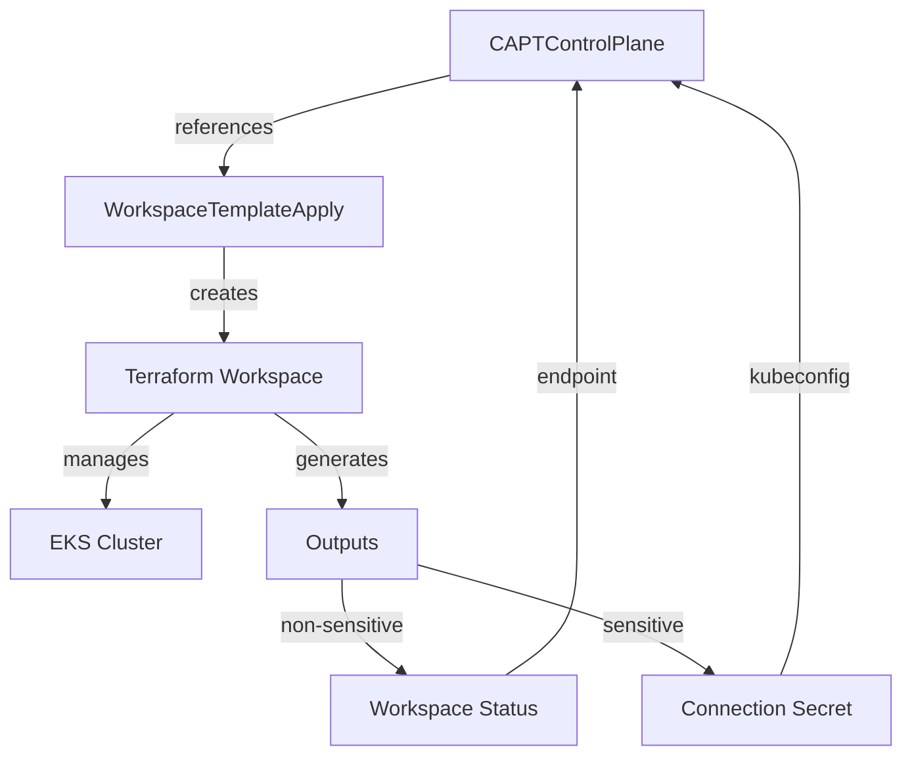

# CAPT Control Plane Secrets Design

## 概要

このドキュメントは、CAPTプロジェクトにおけるControl Plane Secretsの設計仕様を定義します。
CAPTはAWS EKSクラスターをTerraformで管理するため、一般的なCluster APIプロバイダーとは異なるアプローチを採用します。

## 基本設計

### アーキテクチャ



### 情報管理の階層構造

1. **非機密情報（Workspace Status）**
   - cluster_endpoint
   - cluster_name
   - oidc_provider
   - oidc_provider_arn

2. **機密情報（Connection Secret）**
   - kubeconfig
   - cluster_certificate_authority_data
   - pod_execution_role_arn

### Secret管理の方針

1. **AWS EKSによる証明書管理**
   - クラスター証明書はAWS EKSによって自動的に管理
   - 証明書のローテーションもAWSが自動的に処理

2. **Terraformによる出力管理**
   - 非機密情報: status.atProvider.outputs
   - 機密情報: writeConnectionSecretToRef

3. **Secret保存**
   - 命名規則: `<cluster-name>-eks-connection`
   - Secret Type: connection.crossplane.io/v1alpha1

## Secret仕様

### Connection Secret

```yaml
apiVersion: v1
kind: Secret
metadata:
  name: ${CLUSTER_NAME}-eks-connection
  namespace: ${NAMESPACE}
type: connection.crossplane.io/v1alpha1
data:
  kubeconfig: <base64-encoded-kubeconfig>
  cluster_certificate_authority_data: <base64-encoded-ca-data>
  pod_execution_role_arn: <base64-encoded-role-arn>
```

### Terraform実装

```hcl
# 非機密情報の出力
output "cluster_endpoint" {
  description = "Endpoint for EKS control plane"
  value       = module.eks.cluster_endpoint
}

output "cluster_name" {
  description = "The name of the EKS cluster"
  value       = module.eks.cluster_name
}

# 機密情報の出力
output "cluster_certificate_authority_data" {
  description = "Base64 encoded certificate data"
  value       = module.eks.cluster_certificate_authority_data
  sensitive   = true
}

output "kubeconfig" {
  description = "Kubeconfig in YAML format"
  sensitive   = true
  value      = <<-EOT
    apiVersion: v1
    clusters:
    - cluster:
        certificate-authority-data: ${module.eks.cluster_certificate_authority_data}
        server: ${module.eks.cluster_endpoint}
      name: ${module.eks.cluster_name}
    contexts:
    - context:
        cluster: ${module.eks.cluster_name}
        user: ${module.eks.cluster_name}-admin
      name: ${module.eks.cluster_name}
    current-context: ${module.eks.cluster_name}
    kind: Config
    users:
    - name: ${module.eks.cluster_name}-admin
      user:
        exec:
          apiVersion: client.authentication.k8s.io/v1beta1
          args:
          - eks
          - get-token
          - --cluster-name
          - ${module.eks.cluster_name}
          command: aws
  EOT
}
```

## 実装ガイドライン

### 情報取得戦略

```go
// エンドポイント情報の取得（優先順位付き）
func getClusterEndpoint(ctx context.Context, client client.Client, workspace *unstructured.Unstructured, secret *corev1.Secret) (*clusterv1.APIEndpoint, error) {
    // 1. まずWorkspace Outputsから取得を試みる
    outputs, found, err := unstructured.NestedMap(workspace.Object, "status", "atProvider", "outputs")
    if found && outputs != nil {
        if endpoint, ok := outputs["cluster_endpoint"].(string); ok {
            return &clusterv1.APIEndpoint{
                Host: endpoint,
                Port: 443,
            }, nil
        }
    }

    // 2. Secretからのフォールバック
    if secret != nil {
        if endpointData, ok := secret.Data["cluster_endpoint"]; ok {
            endpoint := string(endpointData)
            return &clusterv1.APIEndpoint{
                Host: endpoint,
                Port: 443,
            }, nil
        }
    }

    return nil, fmt.Errorf("endpoint not found in both workspace outputs and secret")
}

// Secret取得と検証
func getAndValidateSecret(ctx context.Context, client client.Client, cluster *clusterv1.Cluster) (*corev1.Secret, error) {
    secret := &corev1.Secret{}
    key := types.NamespacedName{
        Namespace: cluster.Namespace,
        Name:      fmt.Sprintf("%s-eks-connection", cluster.Name),
    }
    
    if err := client.Get(ctx, key, secret); err != nil {
        return nil, fmt.Errorf("failed to get secret: %v", err)
    }
    
    // 必要なフィールドの存在確認
    requiredFields := []string{
        "kubeconfig",
        "cluster_certificate_authority_data",
        "pod_execution_role_arn",
    }
    for _, field := range requiredFields {
        if _, ok := secret.Data[field]; !ok {
            return nil, fmt.Errorf("required field %s not found in secret", field)
        }
    }
    
    return secret, nil
}
```

### エラーハンドリングとロギング

```go
func reconcileSecret(ctx context.Context, r *CAPTControlPlaneReconciler, controlPlane *controlplanev1beta1.CAPTControlPlane) error {
    logger := log.FromContext(ctx)

    // WorkspaceTemplateApplyの取得
    workspaceApply := &infrastructurev1beta1.WorkspaceTemplateApply{}
    if err := r.Get(ctx, types.NamespacedName{
        Name:      controlPlane.Spec.WorkspaceTemplateApplyName,
        Namespace: controlPlane.Namespace,
    }, workspaceApply); err != nil {
        logger.Error(err, "Failed to get WorkspaceTemplateApply")
        return err
    }

    // Secretの取得と検証
    secret, err := getAndValidateSecret(ctx, r.Client, controlPlane)
    if err != nil {
        logger.Error(err, "Failed to get or validate secret")
        return err
    }

    logger.Info("Successfully reconciled secret",
        "name", secret.Name,
        "namespace", secret.Namespace)

    return nil
}
```

## セキュリティ考慮事項

### AWS IAM統合

- EKSクラスターへのアクセスはAWS IAMで制御
- kubeconfigはAWS CLIの認証情報を使用
- 最小権限の原則に従ったIAMロールの設定

### 暗号化

- AWS KMSによるSecrets暗号化
- EKS制御プレーンとの通信はTLSで保護
- etcdの暗号化はAWSが管理

### RBAC設定

```yaml
//+kubebuilder:rbac:groups=tf.upbound.io,resources=workspaces,verbs=get;list;watch
//+kubebuilder:rbac:groups="",resources=secrets,verbs=get;list;watch;create;update;patch;delete
```

## 運用管理

### モニタリング

以下の項目を監視：

1. Secret作成状態
   - Secret存在確認
   - 必須フィールドの存在確認
   - 値の形式検証

2. エンドポイント可用性
   - エンドポイントの到達性確認
   - TLS証明書の有効性確認

3. AWS認証状態
   - IAMロールの有効性
   - トークンの有効期限

### トラブルシューティング

一般的な問題の診断手順：

1. WorkspaceTemplateApplyのステータス確認
   ```bash
   kubectl get workspacetemplateapply <name> -o yaml
   ```

2. Terraform Workspaceの出力確認
   ```bash
   kubectl get workspace <name> -o yaml
   ```

3. Secret内容の確認
   ```bash
   kubectl get secret <name> -o yaml
   ```

4. エンドポイント到達性の確認
   ```bash
   curl -k https://<endpoint>
   ```

## 移行ガイド

既存のデプロイメントからの移行手順：

1. WorkspaceTemplateの更新
   - writeConnectionSecretToRefの設定
   - 適切なTerraform出力の定義

2. Secret命名規則の統一
   - `<cluster-name>-eks-connection`形式への移行
   - 既存Secretsの移行

3. アプリケーション設定の更新
   - 新しいSecret名の参照
   - AWS認証情報の設定

## 参考資料

- [AWS EKS Documentation](https://docs.aws.amazon.com/eks/)
- [Terraform AWS Provider](https://registry.terraform.io/providers/hashicorp/aws/latest/docs)
- [Cluster API Documentation](https://cluster-api.sigs.k8s.io/)
- [AWS IAM Authenticator](https://docs.aws.amazon.com/eks/latest/userguide/install-aws-iam-authenticator.html)
