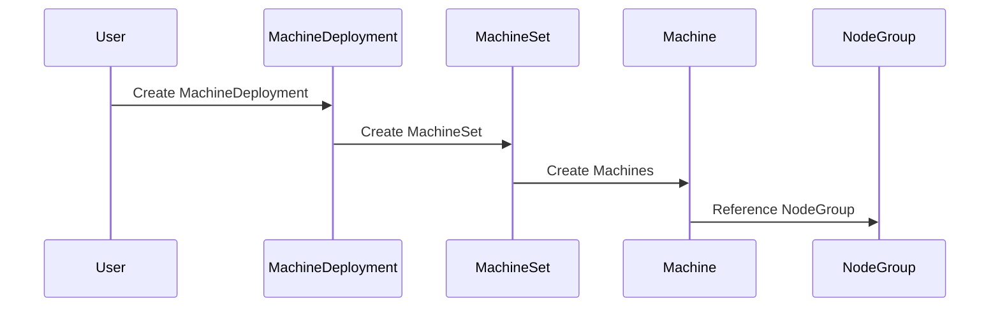
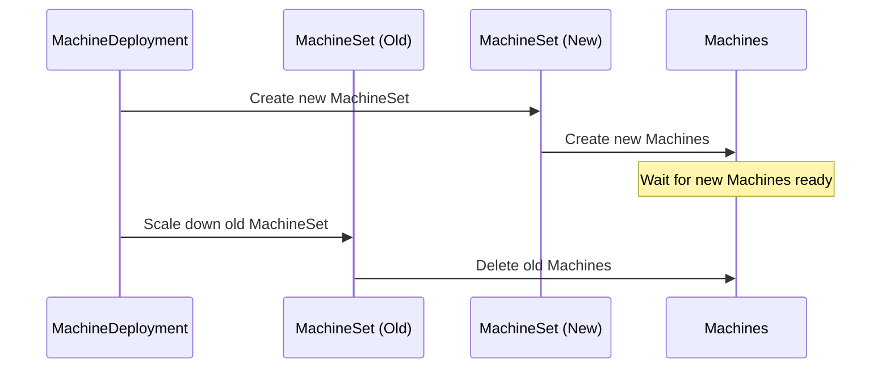
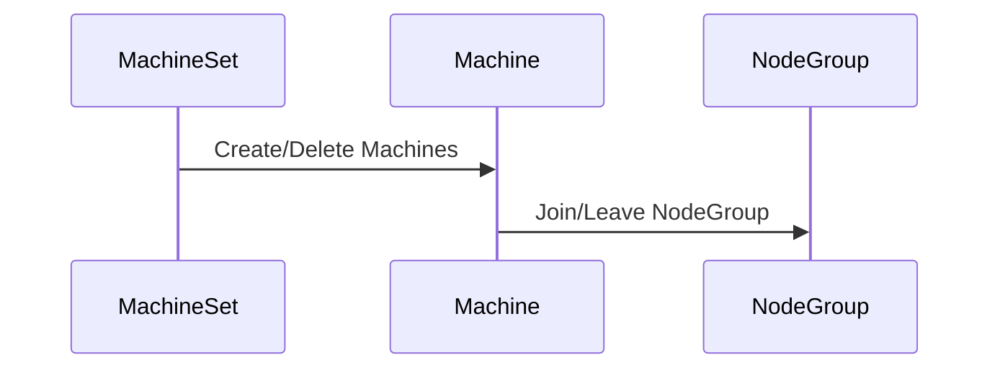

# Machine Management Design Details

## Resource Relationships

### リソース間の関係

```
MachineDeployment
└── owns → MachineSet
    └── owns → Machine
        ├── references → NodeGroup
        └── owns → WorkspaceTemplateApply
```

### 各リソースの参照関係

1. MachineDeployment → MachineSet
- オーナーシップ関係
- テンプレートの伝播
- 更新戦略の制御

2. MachineSet → Machine
- オーナーシップ関係
- テンプレートからのインスタンス化
- レプリカ数の管理

3. Machine → NodeGroup
- 参照関係
- NodeGroupの設定の利用
- ノードの所属先

## Processing Flow

### 1. MachineDeploymentの作成時



1. ユーザーがMachineDeploymentを作成
2. MachineDeploymentコントローラーがMachineSetを作成
3. MachineSetコントローラーが指定数のMachineを作成
4. 各MachineがNodeGroupを参照してノードを作成

### 2. 更新時の処理フロー（RollingUpdate）



1. 新しいMachineSetを作成
2. 新しいMachineSetで新しいMachineを作成
3. 新しいMachineの準備完了を待機
4. 古いMachineSetをスケールダウン

### 3. スケーリング時の処理フロー



1. MachineSetがレプリカ数の変更を検知
2. 必要に応じてMachineを作成または削除
3. NodeGroupのメンバーシップが更新

## Responsibility Separation

### MachineDeploymentの責務
1. 更新戦略の実装
   - RollingUpdateの制御
   - Recreateの制御
   - 更新の進行状況監視

2. MachineSetのライフサイクル管理
   - 新しいMachineSetの作成
   - 古いMachineSetの削除
   - リビジョン履歴の管理

3. ステータス管理
   - 更新の進行状況
   - 利用可能なレプリカ数
   - 失敗状態の追跡

### MachineSetの責務
1. レプリカ数の管理
   - スケールアップ/ダウン
   - レプリカ数の監視
   - 自動スケーリング（将来的な機能）

2. Machine管理
   - Machineの作成
   - Machineの削除
   - テンプレートの適用

3. ステータス同期
   - 実際のレプリカ数
   - 準備完了レプリカ数
   - 利用可能レプリカ数

### Machineの責務
1. ノードのライフサイクル管理
   - ノードの作成
   - ノードの設定
   - ノードの削除

2. NodeGroup連携
   - NodeGroupの参照
   - NodeGroup設定の利用
   - メンバーシップの管理

3. インフラストラクチャ管理
   - WorkspaceTemplateApplyの管理
   - Terraformリソースの制御
   - ステータスの同期

## Design Considerations

### 1. スケーラビリティ
- 大規模クラスターでの動作を考慮
- 効率的なリソース管理
- 並行処理の最適化

### 2. 信頼性
- 障害時の自動復旧
- 一貫性の保証
- デッドロックの防止

### 3. 運用性
- 簡単な設定
- 明確なステータス
- トラブルシューティングの容易さ

### 4. セキュリティ
- RBAC統合
- セキュアな設定管理
- 監査ログ

## Future Enhancements

1. 自動スケーリング
- メトリクスベースのスケーリング
- スケジュールベースのスケーリング
- カスタムスケーリングポリシー

2. 高度な更新戦略
- カナリアデプロイメント
- ブルー/グリーンデプロイメント
- カスタム更新戦略

3. 運用機能の強化
- 自動修復
- 自動置換
- バックアップ/リストア
