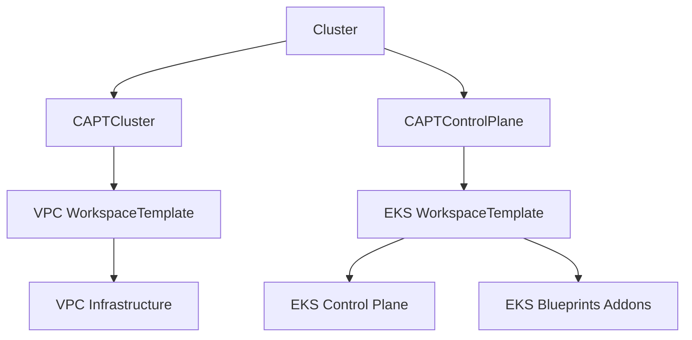

# EKS Cluster Design with WorkspaceTemplate

## Overview

This document describes the design of EKS cluster creation using WorkspaceTemplate-based approach. The design follows a modular structure where each component (VPC, Control Plane) is managed through its own WorkspaceTemplate, allowing for better separation of concerns and management.

## Architecture

The cluster creation is divided into three main components:

1. VPC Infrastructure
2. EKS Control Plane
3. Cluster Configuration

Each component is defined in separate files under `config/samples/cluster/` for better maintainability and clarity.

### Component Relationships



## Component Details

### 1. VPC Infrastructure (`vpc.yaml`)

The VPC infrastructure is managed through a WorkspaceTemplate that creates:
- VPC with public and private subnets
- NAT Gateway
- Appropriate tagging for EKS and Karpenter

Key features:
```yaml
module "vpc" {
  source = "terraform-aws-modules/vpc/aws"
  # ...
  private_subnet_tags = {
    "karpenter.sh/discovery" = local.name
    "kubernetes.io/role/internal-elb" = "1"
  }
}
```

### 2. EKS Control Plane (`controlplane.yaml`)

The EKS control plane is managed through a WorkspaceTemplate that configures:
- EKS cluster with Fargate profiles
- EKS Blueprints addons (CoreDNS, VPC-CNI, Kube-proxy)
- Karpenter setup
- Access management

Key features:
```yaml
module "eks" {
  source = "terraform-aws-modules/eks/aws"
  # ...
  fargate_profiles = {
    karpenter = { selectors = [{ namespace = "karpenter" }] }
    kube_system = { selectors = [{ namespace = "kube-system" }] }
  }
}

module "eks_blueprints_addons" {
  source = "aws-ia/eks-blueprints-addons/aws"
  # ...
  enable_karpenter = true
}
```

### 3. Cluster Configuration (`cluster.yaml`)

The cluster configuration ties everything together through:
- CAPTCluster for infrastructure management
- CAPI Cluster for overall cluster management
- References to control plane and infrastructure components

Key features:
```yaml
spec:
  clusterNetwork:
    services:
      cidrBlocks: ["10.96.0.0/12"]
    pods:
      cidrBlocks: ["192.168.0.0/16"]
```

## Implementation Details

### VPC Configuration

The VPC is configured with:
- Three availability zones
- Private and public subnets
- Single NAT Gateway for cost optimization
- Proper tagging for EKS and Karpenter integration

### EKS Control Plane Configuration

The EKS control plane includes:
1. Fargate Profiles:
   - kube-system namespace
   - karpenter namespace

2. EKS Blueprints Addons:
   - CoreDNS configured for Fargate
   - VPC-CNI
   - Kube-proxy
   - Karpenter

3. Access Management:
   - Cluster creator admin permissions
   - Karpenter node access configuration

### Resource Management

Resources are managed through:
1. WorkspaceTemplates for infrastructure components
2. WorkspaceTemplateApplies for template instantiation
3. CAPTControlPlane for control plane management
4. CAPTCluster for infrastructure coordination

## Usage

To create a cluster:

1. Apply VPC resources:
```bash
kubectl apply -f config/samples/cluster/vpc.yaml
```

2. Apply control plane resources:
```bash
kubectl apply -f config/samples/cluster/controlplane.yaml
```

3. Apply cluster configuration:
```bash
kubectl apply -f config/samples/cluster/cluster.yaml
```

## Best Practices

1. Resource Organization:
   - Keep related resources in the same file
   - Use consistent naming across resources
   - Maintain clear dependencies between components

2. Configuration Management:
   - Use variables for customizable values
   - Implement proper tagging for resource tracking
   - Follow AWS and Kubernetes best practices

3. Security:
   - Implement least privilege access
   - Use private subnets for worker nodes
   - Configure appropriate security groups

## References

- [WorkspaceTemplate API Specification](../api/v1beta1/workspacetemplate_types.go)
- [CAPTControlPlane Implementation](../api/controlplane/v1beta1/captcontrolplane_types.go)
- [CAPTCluster Implementation](../api/v1beta1/captcluster_types.go)
