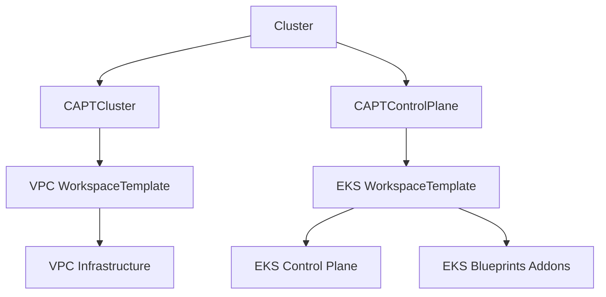

# WorkspaceTemplateを使用したEKSクラスター設計

## 概要

このドキュメントでは、WorkspaceTemplateベースのアプローチを使用したEKSクラスター作成の設計について説明します。この設計は、各コンポーネント（VPC、コントロールプレーン）を独自のWorkspaceTemplateを通じて管理する、モジュラー構造に従っており、より良い関心の分離と管理を可能にします。

## アーキテクチャ

クラスターの作成は、以下の3つの主要コンポーネントに分かれています：

1. VPCインフラストラクチャ
2. EKSコントロールプレーン
3. クラスター設定

各コンポーネントは、保守性と明確性を高めるため、`config/samples/cluster/`配下の個別のファイルで定義されています。

### コンポーネントの関係



## コンポーネントの詳細

### 1. VPCインフラストラクチャ（`vpc.yaml`）

VPCインフラストラクチャは、以下を作成するWorkspaceTemplateを通じて管理されます：
- パブリックおよびプライベートサブネットを持つVPC
- NATゲートウェイ
- EKSとKarpenter用の適切なタグ付け

主な機能：
```yaml
module "vpc" {
  source = "terraform-aws-modules/vpc/aws"
  # ...
  private_subnet_tags = {
    "karpenter.sh/discovery" = local.name
    "kubernetes.io/role/internal-elb" = "1"
  }
}
```

### 2. EKSコントロールプレーン（`controlplane.yaml`）

EKSコントロールプレーンは、以下を設定するWorkspaceTemplateを通じて管理されます：
- Fargateプロファイル付きEKSクラスター
- EKS Blueprintsアドオン（CoreDNS、VPC-CNI、Kube-proxy）
- Karpenterのセットアップ
- アクセス管理

主な機能：
```yaml
module "eks" {
  source = "terraform-aws-modules/eks/aws"
  # ...
  fargate_profiles = {
    karpenter = { selectors = [{ namespace = "karpenter" }] }
    kube_system = { selectors = [{ namespace = "kube-system" }] }
  }
}

module "eks_blueprints_addons" {
  source = "aws-ia/eks-blueprints-addons/aws"
  # ...
  enable_karpenter = true
}
```

### 3. クラスター設定（`cluster.yaml`）

クラスター設定は、以下を通じてすべてを結びつけます：
- インフラストラクチャ管理用のCAPTCluster
- 全体的なクラスター管理用のCAPIクラスター
- コントロールプレーンとインフラストラクチャコンポーネントへの参照

主な機能：
```yaml
spec:
  clusterNetwork:
    services:
      cidrBlocks: ["10.96.0.0/12"]
    pods:
      cidrBlocks: ["192.168.0.0/16"]
```

## 実装の詳細

### VPC設定

VPCは以下のように設定されます：
- 3つのアベイラビリティゾーン
- プライベートおよびパブリックサブネット
- コスト最適化のための単一のNATゲートウェイ
- EKSとKarpenter統合のための適切なタグ付け

### EKSコントロールプレーン設定

EKSコントロールプレーンには以下が含まれます：
1. Fargateプロファイル：
   - kube-systemネームスペース
   - karpenterネームスペース

2. EKS Blueprintsアドオン：
   - Fargate用に設定されたCoreDNS
   - VPC-CNI
   - Kube-proxy
   - Karpenter

3. アクセス管理：
   - クラスター作成者の管理者権限
   - Karpenterノードアクセス設定

### リソース管理

リソースは以下を通じて管理されます：
1. インフラストラクチャコンポーネント用のWorkspaceTemplates
2. テンプレートインスタンス化用のWorkspaceTemplateApplies
3. コントロールプレーン管理用のCAPTControlPlane
4. インフラストラクチャ調整用のCAPTCluster

## 使用方法

クラスターを作成するには：

1. VPCリソースの適用：
```bash
kubectl apply -f config/samples/cluster/vpc.yaml
```

2. コントロールプレーンリソースの適用：
```bash
kubectl apply -f config/samples/cluster/controlplane.yaml
```

3. クラスター設定の適用：
```bash
kubectl apply -f config/samples/cluster/cluster.yaml
```

## ベストプラクティス

1. リソースの組織化：
   - 関連リソースを同じファイルに保持
   - リソース間で一貫した命名を使用
   - コンポーネント間の依存関係を明確に保持

2. 設定管理：
   - カスタマイズ可能な値には変数を使用
   - リソース追跡のための適切なタグ付けを実装
   - AWSとKubernetesのベストプラクティスに従う

3. セキュリティ：
   - 最小権限アクセスを実装
   - ワーカーノードにはプライベートサブネットを使用
   - 適切なセキュリティグループを設定

## 参照

- [WorkspaceTemplate API仕様](../api/v1beta1/workspacetemplate_types.go)
- [CAPTControlPlane実装](../api/controlplane/v1beta1/captcontrolplane_types.go)
- [CAPTCluster実装](../api/v1beta1/captcluster_types.go)
